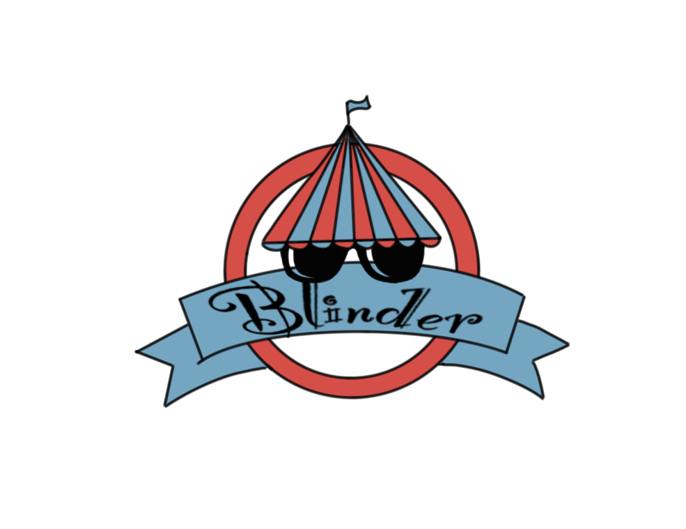

<p align="center">
    
  <h1 align="center">The Invisible One</h1>
  <h4 align="center">Presented by Blinder</h4>
  <p align="center">
  <a href="https://cse125.ucsd.edu/2023/cse125g3/">Link to our website</a>
  <br/>The Invisible One is an original online 3D multi-player role-playing game, where you can experience the joy of solving mazes and collaborate with other players in an immersive musical environment. Help Alice get out of the maze and we will win together!
  </p>
</p>

## How to Run
1. Clone the repo using:  
   install Visual Studio (recommend VS2022)  
   ```sh
    git clone https://github.com/ucsd-cse125-sp23/group-3.git
    ```
2. Run the server:  
   Double click server.sln  
   Run Local Windows Debugger
   
3. Run the client:  
   Double click BlinderEngine.sln  
   Run Local Windows Debugger  
